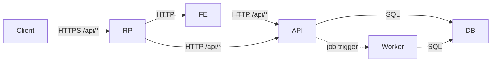

### Project_BitShift – Chronos  
### Intelligent Shift & Vacation Planning System

[](./LICENSE)
[](./CLA.md)


---

## 🧭 Overview

**Chronos** (Project_BitShift) is a modern, web-based planning and scheduling  
system designed as a replacement for:

- manual Excel-based duty planning  
- paper-based vacation & approval processes  
- non-transparent scheduling procedures  

Chronos provides:

- ✔ Digital approval workflows  
- ✔ Transparent, auditable planning  
- ✔ Fair, constraint-aware scheduling  
- ✔ A Linux-first, open source-friendly architecture  
- ✔ Modular frontend & backend components  
- ✔ A foundation for future automation and optimization  

---

## 📚 Documentation

Project documentation is kept in the `docs/` directory:

- **Customer Requirements Specification**  
  `docs/customer-requirements-specification.md`

- **Functional Specification**  
  `docs/functional-specification.md`  
  Key sections: [Interfaces & OpenAPI](docs/functional-specification.md#6-interfaces) · [Deployment & 12-Factor](docs/functional-specification.md#8-deployment--operations)

- **Architecture (Phase 1)**  
  `docs/architecture.md`

- **Authentication (Phase 1)**  
  `docs/authentication.md`

More design and architecture documents will follow as the project grows.

---

## 🏗 Architecture Overview (Phase 1)

Phase 1 runs as a small set of containers: reverse-proxy, frontend, middleware/api, scheduler/worker, and Postgres. The API is OpenAPI-first and authentication uses session cookies (internal users only).



See `docs/architecture.md` and `docs/authentication.md` for details.

---

## 👥 Contributing & Contributor License Agreement (CLA)

Contributions are welcome and encouraged!

To maintain long-term legal clarity and ensure the project can evolve,
**all contributors must agree to the project's Contributor License Agreement (CLA)**.

By signing the CLA, you:

- assign copyright of your contributions to the Project Owner  
- allow the project to be relicensed in the future  
- ensure all historical versions remain under **AGPL-3.0-only**

Please see:

- [`CLA.md`](./CLA.md)  
- [`CONTRIBUTING.md`](./CONTRIBUTING.md)

for details on contribution workflow and legal requirements.

---

## 🛡 License

This project is owned by **Jan Paulzen (VoltKraft)**.  
The source code is licensed under the:

**GNU Affero General Public License v3.0 (AGPL-3.0-only)**

This ensures the project:

- remains free and open source  
- protects user freedoms in networked environments  
- prevents proprietary forks  
- requires public access to source code when deployed as a service  

For full license text, see:  
➡️ [`LICENSE`](./LICENSE)

---

## 🧩 Project Goals (Roadmap Snapshot)

- [ ] Full shift planning workflow  
- [ ] Vacation request workflow  
- [ ] Approval chains (representative → team lead → HR)  
- [ ] Rule-based scheduling engine  
- [ ] Employee preferences & constraints  
- [ ] Audit logs for all actions  
- [ ] Multi-tenant support  
- [ ] OpenID Connect (OIDC) integration  
- [ ] Docker-based deployment  
- [ ] Kubernetes-ready architecture  

*(Roadmap will move into GitHub Projects later.)*

---

## 🔧 Development Setup (short version)

> A complete setup guide will be published later.

```bash
git clone https://github.com/VoltKraft/Project_BitShift.git
cd Project_BitShift
```
---

## 💬 Contact & Community

Issues and feature requests are welcome via GitHub Issues.
Pull Requests are accepted once the [`CLA.md`](./CLA.md)  is accepted.


---

## ⭐ Support the Project

If you find Chronos useful, consider leaving a star on GitHub ⭐
It helps visibility and supports continued development.
