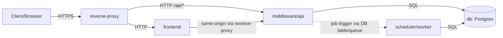

# Architecture (Phase 1)

This document describes the current Phase-1 container/service architecture for Chronos (Project_BitShift). It focuses on internal authentication (no OIDC yet) and the job-based planning workflow. See [authentication.md](authentication.md) for the detailed login flow.

## Current State (Phase 1)

### Container Topology



### Communication Paths

- Client/Browser -> reverse-proxy: HTTPS
- reverse-proxy -> frontend: HTTP (internal)
- reverse-proxy -> middleware/api: HTTP (internal)
- frontend -> middleware/api: via reverse-proxy (same origin)
- middleware/api -> db: SQL
- scheduler/worker -> db: SQL
- middleware/api -> scheduler/worker: job trigger (DB job table polling by default; queue optional)
- scheduler/worker -> middleware/api: no direct calls (future callbacks only, if added)

### Responsibilities (Containers)

#### reverse-proxy

| Purpose | Inbound/Outbound | Data access | Notes |
| --- | --- | --- | --- |
| TLS termination and routing | Inbound: HTTPS from clients. Outbound: HTTP to frontend and middleware/api. | None | Routes "/" -> frontend and "/api/*" -> middleware/api; optional rate limiting and access logs. |

#### frontend

| Purpose | Inbound/Outbound | Data access | Notes |
| --- | --- | --- | --- |
| Web UI (SPA or SSR) | Inbound: HTTP from reverse-proxy. Outbound: HTTP to middleware/api via reverse-proxy. | None | All planning and authentication requests go to middleware/api; never talks to DB; never stores passwords persistently. |

#### middleware/api

| Purpose | Inbound/Outbound | Data access | Notes |
| --- | --- | --- | --- |
| Central API, auth, orchestration, RBAC | Inbound: HTTP /api/* from reverse-proxy. Outbound: SQL to DB; job trigger to worker via DB table/queue. | Read/write DB | Single entry point for frontend and external API calls; owns OpenAPI contract; enforces RBAC on protected endpoints. |

#### scheduler/worker

| Purpose | Inbound/Outbound | Data access | Notes |
| --- | --- | --- | --- |
| Executes planning jobs and writes results | Inbound: job trigger via DB table/queue. Outbound: SQL to DB. | Read/write DB | No public HTTP API; must be idempotent and safe to retry. |

#### db (Postgres)

| Purpose | Inbound/Outbound | Data access | Notes |
| --- | --- | --- | --- |
| Primary data store for auth and planning | Inbound: SQL from middleware/api and scheduler/worker. Outbound: none. | N/A | Recommend logical separation (e.g., auth_* vs planning_* schemas/tables). |

### Interfaces (Phase 1)

- `POST /auth/login` — internal login and session creation (see [authentication.md](authentication.md)).
- `POST /auth/logout` — session invalidation and cookie expiration.
- `/api/*` — versioned business endpoints (planning, leave, scheduling) defined in OpenAPI specs.

### OpenAPI-First API Contract

- OpenAPI is the source of truth for HTTP APIs.
- Spec location (convention): `docs/api/openapi/<service>/openapi.yaml`.
- The middleware/api owns the public contract; service specs can be aggregated or proxied.

### 12-Factor Alignment

- Configuration via environment variables; secrets never live in the repo.
- Logs go to stdout/stderr as structured events.
- Containers are stateless; state lives in Postgres or other backing services.
- Separate process types: reverse-proxy, frontend, middleware/api, scheduler/worker.
- Build/release/run are separated; the same image runs in all environments.

### Environment Variables (examples)

Examples only; values are placeholders. Use local `.env` files for development if needed, but do not commit secrets.

```bash
# Reverse proxy
PROXY_PUBLIC_HOST=chronos.example.com
PROXY_TLS_CERT_PATH=/run/secrets/CHANGE_ME
PROXY_TLS_KEY_PATH=/run/secrets/CHANGE_ME
PROXY_RATE_LIMIT_RPS=CHANGE_ME

# Middleware/API
DATABASE_URL=postgres://CHANGE_ME@db:5432/chronos
SESSION_SECRET=CHANGE_ME
COOKIE_SECURE=true
COOKIE_SAMESITE=Lax
LOG_LEVEL=info
JOB_QUEUE_URL=CHANGE_ME # optional queue integration

# Scheduler/worker
JOB_POLL_INTERVAL=5s

# Frontend
API_BASE_PATH=/api
```

## Planned Later (OIDC/SSO)

- Replace internal login with an OIDC identity provider.
- Middleware validates tokens or exchanges them for server-side sessions.
- Keep IdP-linked identities and claims separated from planning data (e.g., dedicated auth schema).
