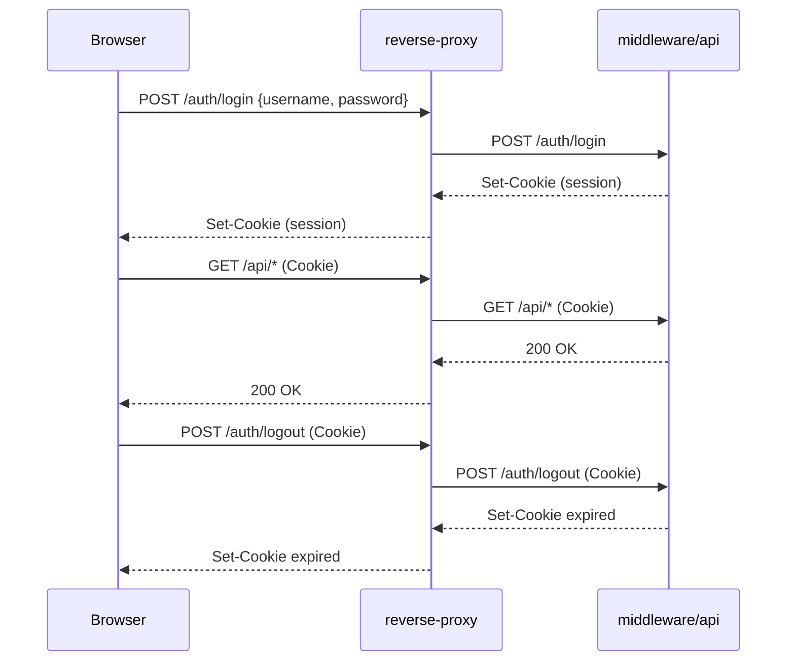

# Authentication (Phase 1)

This document describes the Phase-1 session-cookie authentication flow (internal users, no OIDC yet). It complements [architecture.md](architecture.md).

## Current State (Phase 1)

### Authentication Flow (Session Cookie)

1) Frontend sends `POST /auth/login` with JSON `{ username, password }` over HTTPS (through reverse-proxy).
2) Middleware verifies the password using strong hashing (Argon2id recommended; bcrypt acceptable).
3) Middleware creates a server-side session and returns `Set-Cookie` with `HttpOnly`, `Secure`, `SameSite=Lax`, `Path=/`.
4) Subsequent API calls are authenticated via the cookie; middleware enforces RBAC on protected endpoints.
5) `POST /auth/logout` invalidates the session and expires the cookie.

Passwords are never logged and are transmitted only during login over TLS.

Example request body:

```json
{
  "username": "user@example.com",
  "password": "CHANGE_ME"
}
```

### Auth Sequence Diagram



### Interfaces (Phase 1)

- `POST /auth/login` — authenticate credentials, create server-side session, return cookie.
- `POST /auth/logout` — invalidate session and expire cookie.
- `/api/*` — authenticated endpoints; RBAC enforced. OpenAPI specs live in `docs/api/openapi/<service>/openapi.yaml`.

### Cookie and CSRF Controls

- Cookie attributes: `HttpOnly`, `Secure`, `SameSite=Lax`, `Path=/`.
- CSRF: `SameSite=Lax` is baseline protection; add CSRF tokens for unsafe methods if needed.
- Frontend never stores passwords persistently; credentials are sent only to `/auth/login` over TLS.

### Environment Variables (examples)

```bash
SESSION_SECRET=CHANGE_ME
COOKIE_NAME=chronos_session
COOKIE_SECURE=true
COOKIE_SAMESITE=Lax
PASSWORD_HASH_ALGO=argon2id
```

## Planned Later (OIDC/SSO)

- Replace internal login with an OIDC identity provider.
- Middleware validates tokens or exchanges them for server-side sessions.
- Map IdP roles/claims to RBAC.
- Keep IdP-linked identity data separated from planning data (e.g., dedicated auth schema).
